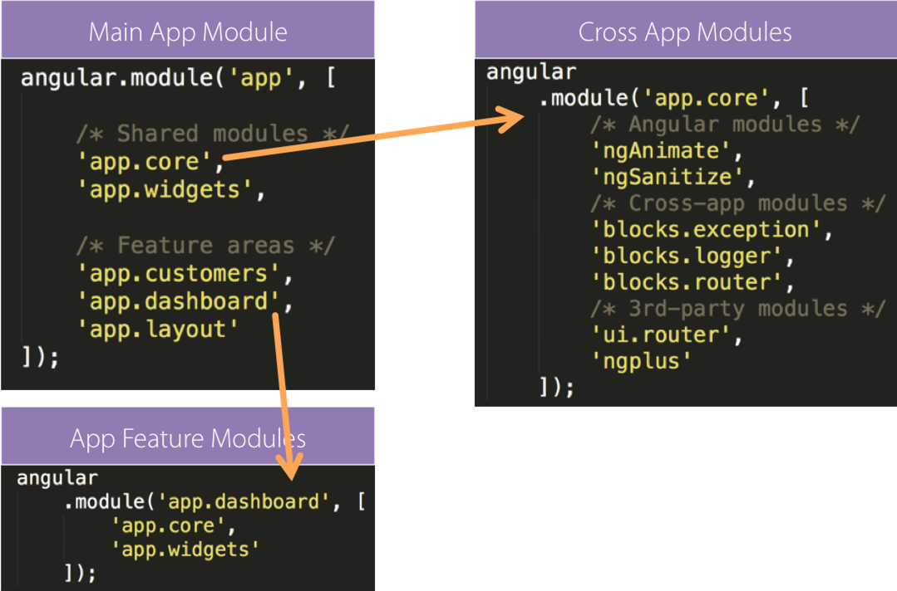

# AngularJS Refresher

## Links:
- https://angularcodereview.com/angularjs/
- https://github.com/toddmotto/angular-styleguide
- https://github.com/johnpapa/angular-styleguide
- https://mgechev.github.io/angularjs-style-guide/
- https://github.com/angular/angular.js/wiki

================================================================================

This is a quick refresher of AngularJS concepts compiled from various articles online.

**Place all common dependencies in one cross-app module:**

Why? To keep feature modules free from dependencies declaration for each module



**Use revealing module pattern to expose interface of services:**

Why?: Placing the callable members at the top makes it easy to read and helps
you instantly identify which members of the service can be called and must be
unit tested (and/or mocked).
Why?: This is especially helpful when the file gets longer as it helps avoid
the need to scroll to see what is exposed.

```javascript
.factory('dataService', dataService);

function dataService() {
    var service = {
        getData: getData,
        pushDta: pushData
    };

    return service;

    // keep implementation at bottom via function declarations

    function getData() {}
    function pushData() {}
}
```

================================================================================

**Use function declarations instead of anonymous functions to keep a structure of code more flat**

```javascript
angular
  .module('app', [])
  .controller('MainCtrl', MainCtrl)
  .service('SomeService', SomeService);

MainCtrl.$inject = [];
SomeService.$inject = [];

function MainCtrl () { }
function SomeService () { }
```

================================================================================

**Send all data in directive isolate scope via one object if possible:**

```html
<input ng-model="user.name">
<input ng-model="user.role">

<user-card user="user"></user-card>
```

================================================================================

**Use one-time binding to show rarely updated data to decrease performance overhead:**

```html
<h1>{{:: page.title  }}</h1>
```

================================================================================

**Use bindToController option in directive definition object in order to set
properties of directive isolate scope on controller instance instead of $scope:**


```javascript
.directive('tabs', tabsDirective);

function tabsDirective() {
    var ddo = {
        bindToController: true,
        link: link
    };

    return ddo;

    function link() {}
}
```

================================================================================

**Use Controller suffix instead of Ctrl for better readability:**

```javascript
.controller('MainController', MainController);

function MainController() {}
```

================================================================================

**Reuse logic via services instead of controllers reuse**

```javascript
.factory('dataService', dataService);

function FirstController(dataService) { }

function SecondController(dataService) { }
```

================================================================================

**Return promise from a services:**

```javascript
.factory('dataService', function($http) {
    var service = {
        getData: getData
    };

    function getData() {
        return $http
                .get('data.json')
                .then(function(data) {
                    return data * 2;
                });
    }
})

.controller('MainController', function(dataService) {
    dataService
        .getData()
        .then(function(data) {
            this.data = data;
        });
});
```

================================================================================

**Avoid using ng-controller ( use controllers via directives instead )**

```javascript
.directive('usersList', userListDirective);

function usersListDirective() {
    var ddo = {
        controller: UsersListController,
        controllerAs: 'usersListController',
        bindToController: true
    };

    return ddo;
}
```

================================================================================

**Avoid using ng-controller in views for routes ( use controllers in config for
routes instead ):**

/* avoid - when using with a route and dynamic pairing is desired */

// route-config.js
```javascript
angular
    .module('app')
    .config(config);

function config($routeProvider) {
    $routeProvider
        .when('/avengers', {
          templateUrl: 'avengers.html'
        });
}
```
<!-- avengers.html -->
```html
<div ng-controller="AvengersController as vm">
</div>
```


/* recommended */

// route-config.js
```javascript
angular
    .module('app')
    .config(config);

function config($routeProvider) {
    $routeProvider
        .when('/avengers', {
            templateUrl: 'avengers.html',
            controller: 'Avengers',
            controllerAs: 'vm'
        });
}
```
<!-- avengers.html -->
```html
<div>
</div>
```

================================================================================

**Controllers are classes so define controllers on prototypes in order to extend
controllers via inheritance:**

```javascript
.controller('BaseController', BaseController);

function BaseController() { }

BaseController.prototype.log = function() {};

function AppController() {}

AppController.prototype = Object.create( BaseController.prototype );
```

================================================================================

**Use consistent file names:**

```
// controllers
avengers.controller.js
avengers.controller.spec.js

// services/factories
logger.service.js
logger.service.spec.js

// constants
constants.js

// module definition
avengers.module.js

// routes
avengers.routes.js
avengers.routes.spec.js

// configuration
avengers.config.js

// directives
avenger-profile.directive.js
avenger-profile.directive.spec.js
```

================================================================================

**Avoid using ng- prefix for directives and $ for custom component names because they are reserved**
Reserve $ for Angular properties and services
Do not use $ to prepend your own object properties and service identifiers.
Consider this style of naming reserved by AngularJS and jQuery.

================================================================================

**Keep project directory structure as flat as possible; use folders-by-feature structure**

```

/**
 * recommended
 */

app/
    app.module.js
    app.config.js
    components/
        calendar.directive.js
        calendar.directive.html
        user-profile.directive.js
        user-profile.directive.html
    layout/
        shell.html
        shell.controller.js
        topnav.html
        topnav.controller.js
    people/
        attendees.html
        attendees.controller.js
        people.routes.js
        speakers.html
        speakers.controller.js
        speaker-detail.html
        speaker-detail.controller.js
    services/
        data.service.js
        localstorage.service.js
        logger.service.js
        spinner.service.js
    sessions/
        sessions.html
        sessions.controller.js
        sessions.routes.js
        session-detail.html
        session-detail.controller.js
```

================================================================================

**Config block**

Inject code into module configuration that must be configured before running
the angular app. Ideal candidates include providers and constants.
Why?: This makes it easier to have less places for configuration.

```javascript
angular
    .module('app')
    .config(configure);

configure.$inject =
    ['routerHelperProvider', 'exceptionHandlerProvider', 'toastr'];

function configure (routerHelperProvider, exceptionHandlerProvider, toastr) {
    exceptionHandlerProvider.configure(config.appErrorPrefix);
    configureStateHelper();

    toastr.options.timeOut = 4000;
    toastr.options.positionClass = 'toast-bottom-right';

    ////////////////

    function configureStateHelper() {
        routerHelperProvider.configure({
            docTitle: 'NG-Modular: '
        });
    }
}
```

================================================================================

**Run Blocks**

Any code that needs to run when an application starts should be declared in
a factory, exposed via a function, and injected into the run block.

Why?: Code directly in a run block can be difficult to test. Placing in
a factory makes it easier to abstract and mock.

```javascript
angular
    .module('app')
    .run(runBlock);

runBlock.$inject = ['authenticator', 'translator'];

function runBlock(authenticator, translator) {
    authenticator.initialize();
    translator.initialize();
}
```

================================================================================

**Use Angular $ Wrapper Services instead of native implementations because they
trigger $digest cycle as needed thus keeping data binding in sync**

```javascript
$timeout
$interval
$http
$window
$document
```

================================================================================

**Use constants to expose vendor libraries**

Why?: Provides a way to inject vendor libraries that otherwise are globals.
This improves code testability by allowing you to more easily know what the
dependencies of your components are (avoids leaky abstractions). It also allows
you to mock these dependencies, where it makes sense.

// constants.js

/* global toastr:false, moment:false */
```javascript
(function() {
    'use strict';

    angular
        .module('app.core')
        .constant('toastr', toastr)
        .constant('moment', moment);
})();
```

When constants are used only for a module that may be reused in multiple
applications, place constants in a file per module named after the module.
Until this is required, keep constants in the main module in a constants.js
file.

Why?: Constants can be injected into any angular component, including providers.

================================================================================

**Unbind event listeners on $scope.$destroy \ element.on('$destroy')**

================================================================================

**Use events on scopes via .$broadcast(), .$emit() and .$on() sparingly**

Events that are relevant globally across the entire app (such as a user
authenticating or the app closing). If you want events specific to modules,
services or widgets you should consider Services, Directive Controllers, or 3rd
Party Libs

================================================================================

**Namespace distributed code**

You shouldn't worry about prefixing internal code, but anything you plan to
OpenSource should be namespaced The ng- is reserved for core directives.
Purpose-namespacing (i18n- or geo-) is better than owner-namespacing (djs- or
igor-)

================================================================================

**All DOM manipulation should be done inside directives**

Exception: DOM manipulation may occur in services for DOM elements disconnected
from the rest of the view, e.g. dialogs or keyboard shortcuts.

================================================================================

**Limit $scope usage**

Only use $scope in controllerAs when necessary; for example, publishing and
subscribing events using $emit, $broadcast, $on or $watch. Try to limit the use
of these, however, and treat $scope as a special use case

================================================================================

**controllerAs 'vm': Capture the this context of the Controller using vm, standing for ViewModel**

Why? : Function context changes the this value, use it to avoid .bind() calls and scoping issues

================================================================================

**ES6: Avoid var vm = this; when using ES6**

// recommended
```javascript
function MainCtrl () {

  let doSomething = arg => {
    console.log(this);
  };

  // exports
  this.doSomething = doSomething;

}
```

Why? : Use ES6 arrow functions when necessary to access the this value lexically

================================================================================

**Always return a host Object instead of the revealing Module pattern due to the way Object references are bound and updated**

```javascript
function AnotherService () {
  var AnotherService = {};
  AnotherService.someValue = '';
  AnotherService.someMethod = function () {

  };
  return AnotherService;
}
angular
  .module('app')
  .factory('AnotherService', AnotherService);
```

Why? : Primitive values cannot update alone using the revealing module pattern

================================================================================

**Use UpperCase for everything except filters and directives**

Directives and Filters are the only providers that have the first letter as
lowercase; this is due to strict naming conventions in Directives. Angular
hyphenates camelCase, so dragUpload will become <div drag-upload></div> when
used on an element.

================================================================================

**Global filters: Create global filters using angular.filter() only. Never use local filters inside Controllers/Services**

This enhances testing and reusability

================================================================================

**$rootScope: Use only $emit as an application-wide event bus and remember to unbind listeners**

```javascript
// all $rootScope.$on listeners
$rootScope.$emit('customEvent', data);
```
================================================================================

**Destroy $rootScope event listeners when a relevant child $scope is destroyed**

Because the $rootScope is never destroyed, $rootScope.$on listeners aren't
either, unlike $scope.$on listeners and will always persist, so they need
destroying when the relevant $scope fires the $destroy event

```javascript
// call the closure
var unbind = $rootScope.$on('customEvent'[, callback]);
$scope.$on('$destroy', unbind);
```

For multiple $rootScope listeners, use an Object literal and loop each one on the $destroy event to unbind all automatically

```javascript
var unbind = [
  $rootScope.$on('customEvent1'[, callback]),
  $rootScope.$on('customEvent2'[, callback]),
  $rootScope.$on('customEvent3'[, callback])
];
$scope.$on('$destroy', function () {
  unbind.forEach(function (fn) {
    fn();
  });
});
```
================================================================================

**Consider $scope.$digest: Use $scope.$digest over $scope.$apply where it makes sense. Only child scopes will update**

```javascript
$scope.$digest();
```

Why? : $scope.$apply will call $rootScope.$digest, which causes the entire
application $$watchers to dirty-check again. Using $scope.$digest will dirty
check current and child scopes from the initiated $scope

================================================================================

**Use ng-annotate to automate dependency injection and keep code free from manual injection annotations**

```javascript
/* @ngInject */
function MainCtrl (SomeService) {
  this.doSomething = SomeService.doSomething;
}
angular
  .module('app')
  .controller('MainCtrl', MainCtrl);
```
================================================================================

**Use ng-strict-di attribute on ng-app to ensure all functions with dependencies are properly annotated & to improve performance**

The performance gain lies in the fact that the injected modules are annotated explicitly, hence they don’t need to be discovered dynamically.

```html
<div ng-app="myApp" ng-strict-di>
```
================================================================================

**Debounce ng-model**

If you know there is going to be a lot of changes coming from an ng-model, you
can de-bounce the input.

For example if you have a search input like Google, you can de-bounce it by
setting the following ng-model option: ng-model-options="{ debounce: 250 }.

This will ensure that the digest cycle due to the changes in this input model
will get triggered no more then once per 250ms .

================================================================================

**Keep one component per file**

```javascript
//app.controller.js
  .controller('AppController', AppController)

  function AppController() {}

// logger.service.js
  .factory('logger', factory)
  function factory() {
    var logger = {};

    return logger;
  }
```

================================================================================

**Prevent hard-coding watch property name:**

```javascript
$scope.$watch( () => vm.myProp, (newValue, oldValue) => console.log(newValue) );
```

Instead of:
```javascript
  $scope.$watch('myController.myProp', (newValue, oldValue) => ...);
  // OR
  $scope.$watch('$ctrl.myProp', (newValue, oldValue) => ...);
```

================================================================================

**Disable debug info for production to improve performance:**

```javascript
  .config(function($compileProvider) {
    $compileProvider.debugInfoEnabled(false);
  })
```
================================================================================

**Disable log info for production:**

```javascript
  .config(function($logProvider) {
    $logProvider.debugEnabled(false);
  })
```
================================================================================

**Use ng-if instead of ng-show/ng-hide to disable a number of watchers**

================================================================================

**If you have a big ng-repeat sometimes adding “track by” can speed things up:**

Default tracking function tracks items by their identity, use tracking by
identifier instead to provide a performance boost for large lists ( to prevent re-rendering same objects )

```html
<li ng-repeat="item in items track by $index"></li>

<li ng-repeat="item in items track by item.id"></li>
```

http://www.codelord.net/2014/04/15/improving-ng-repeat-performance-with-track-by/

================================================================================

**Avoid using ng-repeat when possible:**

For example, instead of rendering a global navigation using ng-repeat, we could
create our own navigation using the $interpolate provider to render our
template against an Object and convert it into DOM nodes.

================================================================================

**Substitude ng-show/ng-hide and other built-in directives for event listeners (to prevent adding value to $$watchers):**

// BAD
```html
<div ng-show=”something”></div>
```
```javascript
$scope.something = false;
$scope.someMethod = function () {
  $scope.something = true;
};
```

// GOOD
```javascript
var menu = $element.find(‘ul’);
menu.hide();
$scope.someMethod = function () {
  menu.show();
};
```

If you’re building a Directive and some of the logic doesn’t need to rely on
a Model, don’t use Angular for it. This logic will live inside the link
callback.
Inside the link callback, we should advocate the use of addEventListener or
jQuery’s “on” method.

================================================================================

**Limit DOM filters (avoid inline filters):**

Angular runs every single filter twice per $digest cycle once something has
changed. The first run is from the $$watchers detecting any changes, the second
run is to see if there are further changes that need updated values.

Here’s an example of a DOM filter, these are the slowest type of filter,
preprocessing our data would be much faster. If you can, avoid the inline
filter syntax.

```html
{{ filter_expression | filter : expression : comparator }}
```

Angular includes a $filter provider, which you can use to run filters in your
JavaScript before parsing into the DOM.
This will preprocess our data before sending it to the View, which avoids the
step of parsing the DOM
```javascript
$filter('filter')(array, expression, comparator);
```

================================================================================

**Clear after yourself:**

- timers
- $rootScope event listeners
- DOM event listeners
- data stored in services

No need to deregister watchers, they will be removed when the scope is destroyed,
you don't need to manage those
```javascript
var listener = $scope.$watch("quartz", function () {});
// ...
listener();
```

================================================================================

**Prevent unnecessary $digest loop in $timeout:**

Set third parameter in $timeout function to false to skip the $digest loop when
no watched variables are impacted by the invocation of the $timeout callback
function.

================================================================================

**Use primitive value workarounds:**

Having a '.' in your models will ensure that prototypal inheritance is in play. So, use
```html
<input type="text" ng-model="someObj.prop1"> rather than
<input type="text" ng-model="prop1">.
```
If you really want/need to use a primitive, there are two workarounds:
- Use $parent.parentScopeProperty in the child scope. This will prevent the child scope from creating its own property.
- Define a function on the parent scope, and call it from the child, passing the primitive value up to the parent (not always possible)

================================================================================

**Use $httpProvider.applyAsync(true) for performance gains**

Making $httpProvider use applyAsync which executes nearby digest calls just once, using a zero timeout.

```javascript
    myApp.config(function ($httpProvider) {
      $httpProvider.useApplyAsync(true);
    });
```

